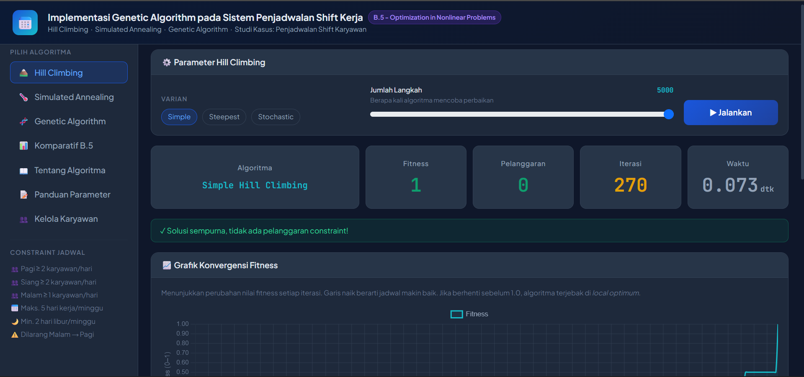

# 📅 Optimasi Nonlinear Penjadwalan Shift Kerja Menggunakan Hill Climbing, Simulated Annealing, dan Genetic Algorithm

Aplikasi simulasi web untuk **Optimization in Nonlinear Problems**.  
Mengimplementasikan dan membandingkan tiga algoritma optimasi pada masalah penjadwalan shift karyawan.

> **Mata Kuliah:** Kecerdasan Buatan  
> **Topik:** Pencarian Lokal dan Optimasi - **Optimization in Nonlinear Problems**  
> **Algoritma:** Hill Climbing (3 varian) · Simulated Annealing · Genetic Algorithm

---

## 🌐 Demo Aplikasi

🔗 **Live Demo:** [https://shift-scheduler.my.id](https://shift-scheduler.my.id)  
📦 **Repository:** [https://github.com/Alnazh/shift-scheduler](https://github.com/Alnazh/shift-scheduler)

---

## 🚀 Fitur Lengkap

| Fitur | Keterangan |
|-------|-----------|
| Hill Climbing | Simple, Steepest-Ascent, Stochastic |
| Simulated Annealing | Cooling schedule + probabilitas Boltzmann |
| Genetic Algorithm | Tournament, crossover single-point, mutasi, elitisme |
| Mode Komparatif B.5 | Semua algoritma pada masalah yang sama |
| Grafik Konvergensi | Fitness per iterasi/generasi (Chart.js) |
| Kurva Suhu SA | Cooling schedule + probabilitas Boltzmann visual |
| Bar Chart Komparatif | Perbandingan fitness, pelanggaran, waktu |
| Tabel Jadwal | Jadwal shift berwarna per karyawan |
| Tabel Metrik B.5 | Waktu konvergensi, kualitas solusi, jumlah iterasi |
| Animasi Step-by-Step | Putar ulang proses pencarian per iterasi |
| Kontrol Parameter | Slider interaktif semua parameter |

---

## 🛠️ Teknologi

| Lapisan | Teknologi |
|---------|-----------|
| Backend | Python 3, Flask, Flask-CORS |
| Frontend | HTML5, CSS3, JavaScript Vanilla |
| UI Framework | Bootstrap 5 (CDN) |
| Grafik | Chart.js (CDN) |
| Font | Plus Jakarta Sans, JetBrains Mono (CDN) |
| Deployment | Railway |
| Domain | `.my.id` |

---

## 📁 Struktur Proyek

```
shift-scheduler/
├── app.py                      # Flask: route halaman + 6 endpoint API
├── algorithms/
│   ├── __init__.py
│   ├── hill_climbing.py        # Simple, Steepest-Ascent, Stochastic HC
│   ├── simulated_annealing.py  # SA + cooling schedule + prob. Boltzmann
│   └── genetic_algorithm.py   # GA: tournament, crossover single-point, mutasi, elitisme
├── models/
│   ├── __init__.py
│   └── jadwal.py               # Data master, constraint, fungsi fitness
├── templates/
│   └── index.html              # Halaman web utama (Bootstrap 5 CDN)
├── static/
│   ├── css/
│   │   └── style.css           # Styling kustom tema gelap
│   └── js/
│       ├── api.js              # Fungsi fetch ke Flask API
│       ├── grafik.js           # Render Chart.js (konvergensi, suhu, komparatif)
│       ├── tabel.js            # Render tabel jadwal & komparatif
│       └── app.js              # Logika utama + animasi step-by-step
├── requirements.txt
├── Procfile
└── .gitignore
```

---

## ⚙️ Cara Menjalankan Lokal

### Prasyarat
- Python 3.9+
- pip

### Langkah

```bash
# 1. Clone repository
git clone https://github.com/Alnazh/shift-scheduler.git
cd shift-scheduler

# 2. Install dependencies
pip install -r requirements.txt

# 3. Jalankan aplikasi
python app.py
```

Buka browser di **`http://localhost:5000`**

---

## 🧬 Penjelasan Algoritma

### Problem: Penjadwalan Shift Karyawan (Nonlinear Problem)
- **10 karyawan**, **4 shift** (Pagi/Siang/Malam/Libur), **7 hari**
- Ruang solusi: 4^(10×7) = 4^70 ≈ 10^42 kemungkinan (nonlinear, NP-hard)

### Fungsi Fitness
```
fitness = 1 / (1 + total_pelanggaran)
```

### Constraint yang Dievaluasi
1. Minimum karyawan per shift per hari (Pagi≥2, Siang≥2, Malam≥1)
2. Maksimum 5 hari kerja per karyawan per minggu
3. Minimum 2 hari libur per karyawan per minggu
4. Larangan shift Malam → Pagi keesokan hari (anti-fatigue)

### Hill Climbing
- **Simple**: evaluasi 1 tetangga, pindah jika ≥ saat ini
- **Steepest-Ascent**: evaluasi semua tetangga, pilih terbaik
- **Stochastic**: tetangga acak, pindah hanya jika lebih baik

### Simulated Annealing
- Terima solusi buruk dengan P = exp(Δf/T) — probabilitas Boltzmann
- Cooling schedule geometris: T = T × α setiap iterasi
- Membantu meloloskan diri dari local optimum

### Genetic Algorithm
- **Representasi**: kromosom = matriks 10×7 nama shift
- **Seleksi**: Tournament (k=3)
- **Crossover**: Single-point
- **Mutasi**: Per-gen dengan probabilitas
- **Elitisme**: n individu terbaik dipertahankan langsung

---

## 📊 Metrik Perbandingan B.5

| Metrik | Keterangan |
|--------|-----------|
| Fitness Akhir | Kualitas solusi terbaik yang ditemukan |
| Pelanggaran | Jumlah constraint yang dilanggar |
| Iterasi/Generasi | Jumlah langkah hingga konvergensi |
| Waktu Eksekusi | Waktu komputasi (detik) |

---

## 🔌 API Endpoints

| Method | Endpoint | Deskripsi |
|--------|----------|-----------|
| GET | `/api/health` | Status server |
| GET | `/api/info` | Data master |
| POST | `/api/hill-climbing` | Jalankan HC (simple/steepest/stochastic) |
| POST | `/api/simulated-annealing` | Jalankan SA |
| POST | `/api/genetic-algorithm` | Jalankan GA |
| POST | `/api/komparatif` | Jalankan semua algoritma (B.5) |

---

## 📸 Tangkapan Layar


---

# 📅 Komparasi Algoritma Metaheuristik pada Sistem Penjadwalan Shift Kerja dengan Visualisasi Interaktif

Aplikasi simulasi web untuk pemecahan **Optimization in Nonlinear Problems**.  
Mengimplementasikan, memvisualisasikan, dan membandingkan tiga algoritma optimasi (Hill Climbing, Simulated Annealing, dan Genetic Algorithm) dalam menyelesaikan masalah penjadwalan shift karyawan.
